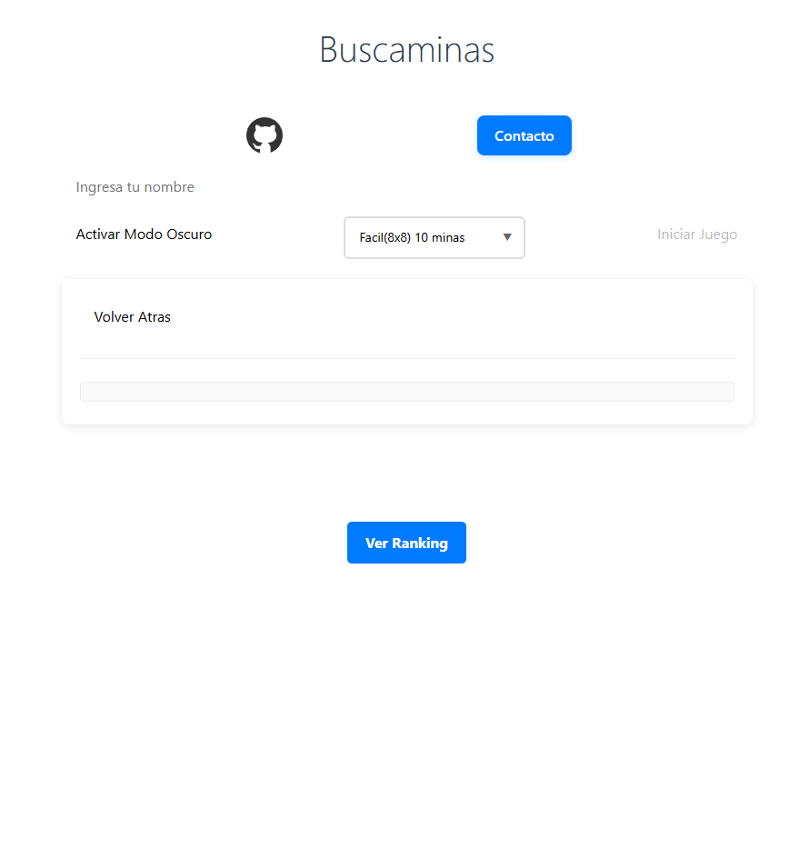
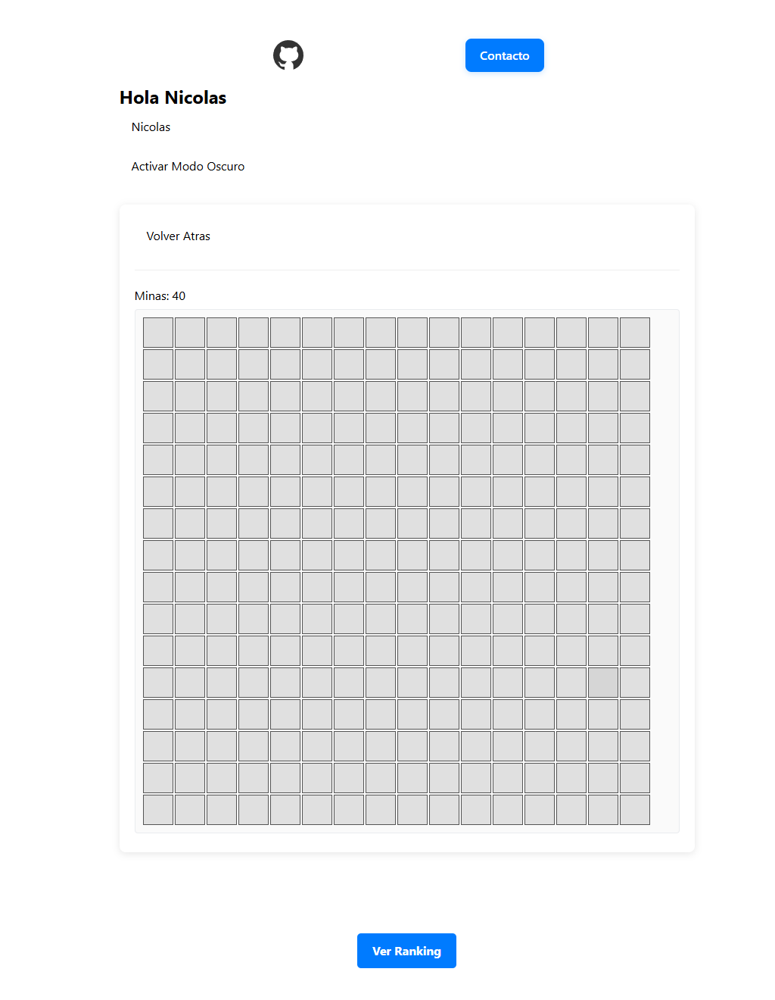

# 🧨 Buscaminas en JavaScript Vanilla

- 🎮 Tres niveles de dificultad: Fácil (8x8), Medio (12x12) y Difícil (16x16).
- 🕹️ Tablero dinámico generado según selección del jugador.
- ⏳ Temporizador regresivo de 5 minutos por partida.
- 🚩 Colocación de banderas con clic derecho.
- 🔁 Expansión automática de casillas vacías.
- 🔁 Chording.
- 💥 Detección de victoria o derrota con animaciones y sonidos.
- 🌙 Modo oscuro y modo claro.
- 🧾 Validación de nombre antes de iniciar partida.
- 📊 Ranking guardado en `localStorage`, con fecha, hora, duración y puntaje.
- 📱 Diseño responsivo.

## 🖼️ Capturas

## ⚙️ Tecnologías

- HTML5
- CSS3 (Flexbox)
- JavaScript ES5 / Vanilla

## 👤 Autores

- Nicolás Andrade
- Alejo Orlandi